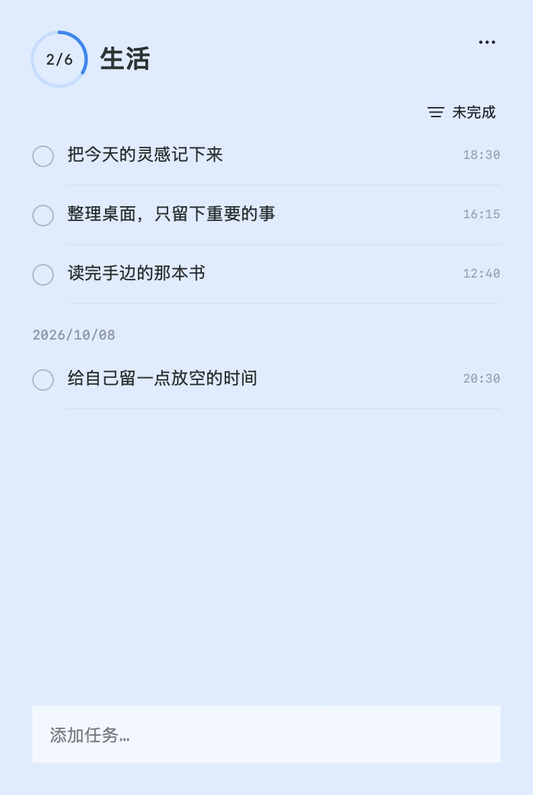
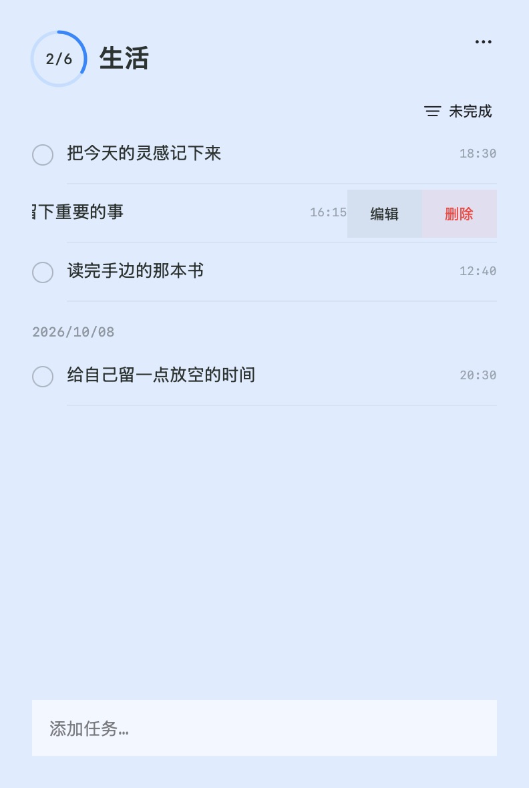

# JustTodo

一个贴在屏幕边缘的极简待办。只有要做的事，没有多余的功能。

A tiny to-do list at the edge of your screen. Nothing extra.

[下载 Apple 芯片版](https://github.com/jiuyaopinyin/JustTodo/releases/latest/download/JustTodo-1.0.0-arm64.dmg) · [下载 Intel 版](https://github.com/jiuyaopinyin/JustTodo/releases/latest/download/JustTodo-1.0.0-x86_64.dmg)

macOS 14+ · 已通过 Apple 公证 · 中文 / English

### 平时，只是桌面边缘的一个小标签

  

每个项目独立驻留，数字就是 **已完成 / 总数**。拖到左侧、右侧或顶部，也能放到外接屏；颜色和透明度随你调整。

### 点开就记，左滑就改

<table>
  <tr>
    <td align="center"><strong>一眼看到待办与进度</strong></td>
    <td align="center"><strong>左滑编辑或删除</strong></td>
  </tr>
  <tr>
    <td></td>
    <td></td>
  </tr>
</table>

无需账户，数据只留在你的 Mac。完成一件事，还有一点彩纸庆祝。

打开 DMG，将 JustTodo 拖入 **Applications** 即可安装。

[更多使用与开发说明](docs/GUIDE.md)
